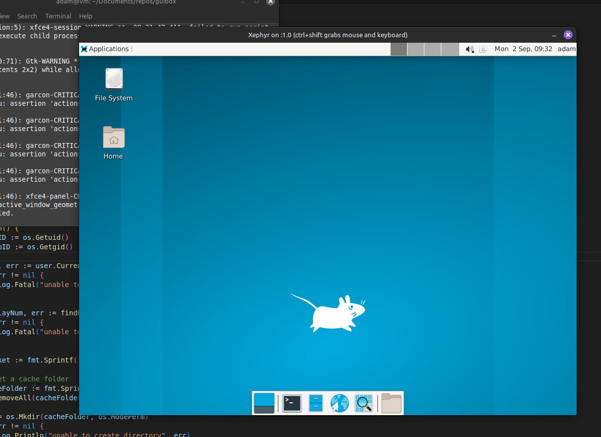

# guibox

## 🚧 WORK IN PROGRESS

## Introduction

This project aims to run desktop applications or complete desktop environments inside a highly sandboxed container, sharing only the X server of the host. Written in golang and based on the excellent x11docker project but focuses exclusively on X server applications with Xephyr and uses Podman for container management.

## Upcoming Features

- **Shortcut Integration:** Automatically create shortcuts on the host machine to launch guest applications seamlessly.

- **Permission Management UI:** A user-friendly interface for managing file permissions and other host accesses for guest applications.

- **Extended CLI:** Additional command-line flags for more granular control and customization.

## Prerequisites

- Go 1.23
- Podman
- Xephyr

